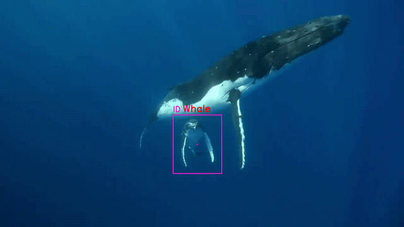

# Underwater Object Tracking

This project focuses on tracking objects in an underwater environment using a custom-trained model.

## Installation
1. Clone this repository:
git clone https://github.com/angelobellafiore/Underwater_Object_Tracking.git

2. Install dependencies:
pip install -r requirements.txt

## Training
Run the training script:
python main.py train

## Tracking
Run the tracking script on a video:
python main.py tracking --video dataset/name_video.mp4 --model models/best.pt --output results/tracked_output.mp4

## Results
Here’s an example of the tracking output:

